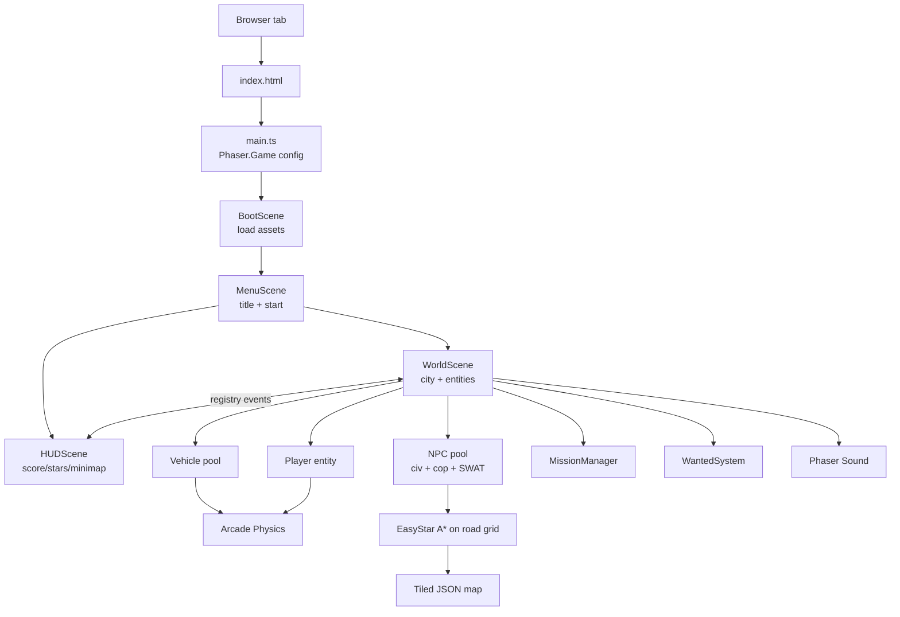

# TGA — Architecture Document

**Version:** 1.0 (Architecture iteration 1)
**Status:** Binding decision — pending user approval before coding begins
**Date:** 2026-05-21
**Author:** systems-architect (autonomous)
**Companion to:** [PRD.md](./PRD.md)

---

## 1. Executive summary

- **Engine:** **Phaser 3.80+ with TypeScript 5**, bundled by **Vite 5**. This is by far the lowest-risk, fastest-to-MVP path for a 16-px top-down tilemap game with car physics, NPCs, and Tiled maps. Mature ecosystem, hundreds of directly applicable tutorials, strong AI-tool support, ~500 KB minified — well inside the 10 MB bundle budget.
- **Physics:** **Phaser Arcade Physics** for everything in MVP (AABB + circles, hand-rolled bicycle-model car heading on top of the velocity vector). We deliberately reject Matter.js — it's overkill for top-down 16-px tile games, adds bundle weight, and the docs explicitly say "don't use Matter unless you can't fake it with Arcade."
- **Key tradeoffs:** We trade some performance headroom (vs. PixiJS + custom) and some "modern DX" (vs. Excalibur) for a battle-tested, GTA-shaped framework that the team and AI tools already know. We accept Phaser's ~500 KB engine overhead in exchange for not re-implementing scenes, tilemap rendering, audio, input, and a particle system.

---

## 2. Decision table

| Concern | Considered | Chosen | Rationale |
|---|---|---|---|
| **Engine** | Phaser 3, Excalibur.js, Kaplay, Godot 4 HTML5, PixiJS + custom | **Phaser 3 (3.80+)** | Most tutorials for *exactly this game*; Tiled JSON loader built-in; Arcade Physics handles top-down driving cleanly; ~500 KB engine size; best Safari/iOS performance of JS engines; AI assistants give the most accurate answers for it. |
| **Language** | JavaScript, TypeScript | **TypeScript 5** | Mission state machine, wanted-level FSM, scoring math, AI hooks, and entity component types all benefit from compile-time safety. Official Phaser template is TS. Cost: 0 — Vite handles it. |
| **Build tool** | Vite, Webpack, Parcel, esbuild | **Vite 5** | Used by the official `phaserjs/template-vite-ts` template. Fast HMR, near-zero config, ESM-native, production builds via Rollup. Webpack is heavier, esbuild lacks the dev-server ergonomics. |
| **Map format** | Hand-coded 2D arrays, LDtk, Tiled (TMX/JSON) | **Tiled → JSON** | Industry standard. Phaser has first-class loader (`load.tilemapTiledJSON`). Free editor, runs on Linux/Mac/Win. LDtk is nicer-looking but Phaser support is via community plugin. |
| **Physics** | Arcade Physics, Matter.js, Planck.js, custom AABB | **Arcade Physics** | Built into Phaser, AABB + circle collisions, group/overlap helpers cover cop chases, weapon hits, car-vs-tile. Car "feel" implemented on top of Arcade body velocity. Matter.js rejected: 2–3× perf cost, larger bundle, unneeded for top-down. |
| **Car physics model** | Full rigid-body sim, bicycle model, velocity+heading + drift decay | **Velocity + heading + drift decay** | Matches GTA 1 feel. Hand-coded in ~80 lines of TS on top of Arcade body. Tunable per-vehicle (sedan / sports / truck) via a config object. |
| **Pathfinding** | A* on road graph, flow-field, naive "drive toward player" | **EasyStar.js (A* on tile grid)** | Tiny library (~10 KB), proven for tile-based games. Cops path on the road tile layer. Cached per-cop, recomputed every ~500 ms or on player move ≥1 tile. |
| **Audio** | Web Audio API direct, Howler.js, Phaser sound | **Phaser sound (built-in)** | Already in the bundle. Spatial pan, looping, volume, mute. Howler adds 30 KB for marginal gain. Mute key (M) toggles `sound.mute`. |
| **State management** | Redux, Zustand, plain TS singletons, Phaser registry | **Plain TS singletons + Phaser registry** | Game state (score, wanted, mission, HP) lives in a small `GameState` module. Scene-to-scene data via Phaser's `Registry`. Avoid React-ecosystem libs — no UI framework here. |
| **HUD** | DOM/CSS overlay, Phaser UI scene, React overlay | **Phaser UI scene** | Single `HUDScene` rendered on top of the world scene. Avoids DOM/canvas coordinate juggling. Mini-map is a `RenderTexture` updated 4×/s. |
| **Unit testing** | Vitest, Jest, Bun test | **Vitest** | Native Vite integration, fast, same TS config as the app. Tests pure logic: scoring, FSM, wanted cool-down, mission validators. |
| **Integration testing** | Playwright, Puppeteer, Cypress | **Playwright** | Cross-browser, fast, headless, screenshot snapshots. Drives the game via keyboard events; asserts score, HP, win overlay. |
| **Linting / format** | ESLint + Prettier, Biome | **ESLint + Prettier** | Industry default; team familiarity. Biome is faster but Phaser-aware rules are easier with ESLint. |
| **Asset pipeline** | Raw imports, Vite `?url` imports, asset packs | **Vite static imports + Phaser asset packs** | All assets in `public/assets/`; loaded via `this.load.image/audio/tilemapTiledJSON` in a `BootScene`. Vite copies `public/` verbatim. |
| **Hosting (dev/prod local)** | Vite dev server, nginx in Docker, http-server | **nginx in Docker Compose (prod build)** + Vite dev server (dev) | Per workspace standard. `run.sh start` runs `npm run build` then `docker compose up`. Dev mode `run.sh dev` skips Docker, uses Vite HMR. |
| **Port** | 8080, 3000, 5173 | **8080** for nginx, **5173** for Vite dev | Both standard defaults for those tools; no conflict. |
| **CI** | GitHub Actions | **GitHub Actions** (lint, typecheck, vitest, playwright, build size budget) | Standard. PR-blocking. Bundle-size check fails if final dist > 10 MB. |

---

## 3. Engine deep-dive (the rejected paths)

### 3.1 Excalibur.js — rejected
- **Pros:** TypeScript-first, smaller (~300 KB), nice actor/scene model, ECS optional, browser-extension debug tools.
- **Cons:** Smaller community → fewer tutorials for top-down driving games. AI assistants hallucinate more on Excalibur API. No demonstrated production GTA-shaped game. We'd be the explorers; the PRD wants a 4–8-week MVP.
- **Verdict:** A reasonable choice for a v2 rewrite if Phaser becomes painful. Not for v1.

### 3.2 Kaplay (Kaboom fork) — rejected
- **Pros:** Fastest iteration, simplest API, great for game jams.
- **Cons:** Physics is intentionally simplistic; performance limits surface on larger projects with 30+ entities + 128×128 tilemap. Not enough precedent for car-feel physics. Less production-ready audio.
- **Verdict:** Fine for a 48-hour jam clone; wrong for a 16-user-story MVP with cop AI and pathfinding.

### 3.3 Godot 4 + HTML5 export — rejected
- **Pros:** Best editor of any candidate. Excellent tilemap tools. Mature.
- **Cons:** Default HTML5 export is **>40 MB** for a single empty scene; getting below 10 MB requires building custom export templates (disable_3d, disable_advanced_gui, modules_enabled_by_default=no, lto=full). That's a multi-day yak-shave before writing one line of game code. Browser debug is awkward (no DevTools-level integration). GDScript moves us off the workspace's TypeScript norm.
- **Verdict:** If we were shipping desktop too, Godot would win. For browser-only MVP under 10 MB, the bundle math doesn't work without weeks of build engineering.

### 3.4 PixiJS + Planck.js / Matter.js — rejected
- **Pros:** Smallest, fastest renderer. Total control.
- **Cons:** We re-implement scene management, input, audio, tilemap rendering, particle system, asset loader. Two engineers for ~4 weeks of plumbing before the game appears. PRD says "smallest playable slice in 4–8 weeks." Math doesn't work.
- **Verdict:** Wrong shape for MVP. Possible foundation for a v3 rewrite if we ever need 60 fps with 200+ entities.

---

## 4. System architecture

### 4.1 High-level diagram



### 4.2 Scene graph

| Scene | Responsibility | Active when |
|---|---|---|
| `BootScene` | Load Tiled JSON, spritesheets, audio, missions.json | Always first |
| `MenuScene` | Title, start button, mute toggle | Pre-game, post-win |
| `WorldScene` | The actual game: city, entities, physics, AI | Playing |
| `HUDScene` | Score, stars, mini-map, mission strip, HP, weapon | Playing (overlay) |
| `PauseScene` | Translucent overlay on P/Esc | Playing → paused |

Scene transitions are explicit (`scene.start`, `scene.launch` for overlays). Game state lives in a `GameState` singleton plus Phaser's `registry`.

### 4.3 Entity model

Plain TypeScript classes extending `Phaser.GameObjects.Sprite` (with `body: Phaser.Physics.Arcade.Body`). No ECS — overkill for 50 entities.

```
abstract Entity (sprite + body + hp)
├── Player
├── Vehicle (Sedan, Sports, Truck, CopCar)
└── NPC
    ├── CivilianPed (wander FSM)
    ├── CivilianDriver (lane-follow FSM)
    └── Cop (chase FSM + A* pathing)
        └── SwatCop (extends Cop, more HP, faster)
```

### 4.4 Data flow — wanted level → cop spawn

```
crime event ──► WantedSystem.add(stars)
                  │
                  ├──► HUDScene update (registry event "wantedChanged")
                  ├──► CopSpawner reads new level, spawns N cops
                  └──► CooldownTimer starts (30 s decay if no LoS)
```

### 4.5 Mission flow

```
proximity to payphone ──► press E ──► MissionManager.accept(id)
   │
   ├──► load mission from assets/missions.json
   ├──► spawn waypoint sprite on world + minimap
   ├──► start timer
   └──► HUDScene shows mission strip
                  │
                  ├── on objective met → reward $, +0.1 multiplier, "MISSION PASSED" banner
                  └── on timer ≤ 0 / player death / target destroyed → "MISSION FAILED"
```

### 4.6 No backend
There is no server, no database, no API. Everything runs in-browser. The only network call is the initial asset download from the same origin. This is intentional and locks in the security posture (no PII, no eval, no remote code).

---

## 5. Project directory structure

```
tga/
├── docs/
│   ├── PRD.md
│   ├── architecture.md         ← this file
│   └── design.md               (later)
├── public/
│   └── assets/
│       ├── maps/
│       │   ├── city.json       (exported from Tiled)
│       │   └── tileset.png
│       ├── sprites/
│       │   ├── player.png
│       │   ├── peds.png
│       │   ├── cops.png
│       │   ├── vehicles.png
│       │   └── weapons.png
│       ├── audio/
│       │   ├── engine.ogg
│       │   ├── gunshot.ogg
│       │   ├── siren.ogg
│       │   ├── scream.ogg
│       │   ├── explosion.ogg
│       │   ├── pickup.ogg
│       │   ├── ui-click.ogg
│       │   └── city-ambience.ogg
│       ├── missions.json
│       └── LICENSES.md          (CC0/CC-BY attribution)
├── src/
│   ├── main.ts                  (Phaser.Game bootstrap)
│   ├── config.ts                (game-wide tunables: speeds, HP, $ amounts)
│   ├── scenes/
│   │   ├── BootScene.ts
│   │   ├── MenuScene.ts
│   │   ├── WorldScene.ts
│   │   ├── HUDScene.ts
│   │   └── PauseScene.ts
│   ├── entities/
│   │   ├── Entity.ts            (abstract base)
│   │   ├── Player.ts
│   │   ├── vehicles/
│   │   │   ├── Vehicle.ts       (base — bicycle model)
│   │   │   ├── Sedan.ts
│   │   │   ├── Sports.ts
│   │   │   ├── Truck.ts
│   │   │   └── CopCar.ts
│   │   └── npcs/
│   │       ├── NPC.ts
│   │       ├── CivilianPed.ts
│   │       ├── CivilianDriver.ts
│   │       ├── Cop.ts
│   │       └── SwatCop.ts
│   ├── systems/
│   │   ├── WantedSystem.ts      (0–4 stars, decay timer, LoS check)
│   │   ├── MissionManager.ts    (JSON-driven mission FSM)
│   │   ├── ScoringSystem.ts     (score = money * multiplier)
│   │   ├── CopSpawner.ts        (spawns N cops per wanted level)
│   │   ├── PedSpawner.ts        (keeps ~20 peds on-screen)
│   │   ├── Pathfinder.ts        (wraps EasyStar.js)
│   │   ├── InputManager.ts      (keyboard + mouse → intents)
│   │   └── AudioBus.ts          (volume, mute)
│   ├── state/
│   │   ├── GameState.ts         (singleton: hp, $, multiplier, weapon)
│   │   └── events.ts            (typed registry event names)
│   ├── ui/
│   │   ├── HUDScore.ts
│   │   ├── HUDStars.ts
│   │   ├── HUDMinimap.ts        (RenderTexture)
│   │   ├── HUDMissionStrip.ts
│   │   └── HUDStatus.ts         (HP + weapon)
│   ├── types/
│   │   ├── missions.ts          (Mission, MissionType, Waypoint)
│   │   ├── vehicles.ts          (VehicleConfig)
│   │   └── tiled.ts             (typed wrappers around Tiled JSON)
│   └── utils/
│       ├── math.ts              (lerp, angleBetween, clamp)
│       ├── rng.ts               (seedable RNG)
│       └── debug.ts             (~ console)
├── tests/
│   ├── unit/
│   │   ├── scoring.test.ts
│   │   ├── wanted.test.ts
│   │   ├── mission-fsm.test.ts
│   │   └── math.test.ts
│   └── e2e/
│       ├── smoke.spec.ts        (US-1: page loads, player visible <5 s)
│       ├── movement.spec.ts     (US-2…US-5)
│       ├── combat.spec.ts       (US-9, US-10)
│       └── mission.spec.ts      (US-11…US-13)
├── docker/
│   └── nginx.conf
├── .github/workflows/
│   └── ci.yml                   (lint, typecheck, unit, e2e, bundle-size)
├── Dockerfile                   (multi-stage: node build → nginx serve)
├── docker-compose.yml
├── run.sh                       (start/up/stop/restart/logs/build/status/test/shell/clean/help)
├── vite.config.ts
├── tsconfig.json
├── package.json
├── .eslintrc.json
├── .prettierrc
├── .gitignore
└── README.md
```

---

## 6. Docker / deployment spec

### 6.1 Dockerfile (multi-stage)

```
# Stage 1: build
FROM node:20-alpine AS build
WORKDIR /app
COPY package*.json ./
RUN npm ci
COPY . .
RUN npm run build          # → /app/dist

# Stage 2: serve
FROM nginx:1.27-alpine
COPY --from=build /app/dist /usr/share/nginx/html
COPY docker/nginx.conf /etc/nginx/conf.d/default.conf
EXPOSE 80
```

### 6.2 docker-compose.yml spec

- Single service `tga` built from `Dockerfile`.
- Port mapping: `8080:80` (host → container).
- `restart: unless-stopped`.
- No volumes (static site; rebuild to update).
- No env vars required for MVP. (Reserve `TGA_DEBUG=1` for dev console.)
- No network — default bridge is fine; no DB, no cache, no backend.

### 6.3 nginx.conf spec

- Serve `/usr/share/nginx/html` as root.
- `try_files $uri $uri/ /index.html` (SPA-style fallback even though we're a single page — defensive).
- `gzip on` for `.js .css .json .html .svg`.
- Cache headers: `assets/*` → `max-age=31536000, immutable`. `index.html` → `no-cache`.
- No HTTPS in MVP (local Docker only). TLS is a deployment concern for a later cloud phase.

### 6.4 run.sh spec (mirrors workspace standard)

| Command | Action |
|---|---|
| `./run.sh start` / `up` | `npm run build && docker compose up -d`, then print `http://localhost:8080` |
| `./run.sh dev` | `npm run dev` (Vite HMR on `:5173`) — no Docker |
| `./run.sh stop` | `docker compose down` |
| `./run.sh restart` | `stop && start` |
| `./run.sh logs` | `docker compose logs -f tga` |
| `./run.sh build` | `npm run build` only |
| `./run.sh status` | `docker compose ps` |
| `./run.sh test` | `npm run lint && npm run typecheck && npm test && npm run test:e2e` |
| `./run.sh shell` | `docker compose exec tga sh` |
| `./run.sh clean` | `docker compose down -v && rm -rf node_modules dist` |
| `./run.sh help` | print usage |

### 6.5 Bundle-size budget

CI enforces `du -sh dist/ < 10M`. Current rough budget:

| Bucket | Budget |
|---|---|
| Phaser 3 (min) | ~500 KB |
| EasyStar.js | ~10 KB |
| App TS code | ~150 KB |
| Tileset PNG (16 px, ~256 tiles) | ~80 KB |
| Sprite atlases (player + peds + cops + vehicles) | ~400 KB |
| Audio (8 SFX OGG + 1 music) | ~3 MB |
| Tiled JSON (128×128 × 3 layers, gzipped) | ~200 KB |
| Misc (HTML, CSS, fonts) | ~50 KB |
| **Total** | **~4.4 MB** (well under 10 MB) |

---

## 7. Key architecture decisions with rationale

### 7.1 Single `WorldScene` instead of multi-scene world chunks
The 128×128 map is small enough (~32 MB of tile state worst case, far less in practice) to load entirely. Streaming/chunking is a v2 concern. Keeps the codebase honest.

### 7.2 Object pooling for bullets, particles, NPCs
Phaser groups with `createMultiple({active:false,visible:false})` and recycle. Prevents GC stutter on a 60 fps target.

### 7.3 Fixed-step physics, variable-step render
Arcade Physics is called from `update(time, delta)`; we clamp `delta` to a max of 50 ms to avoid tunneling at low frame rates. Render is whatever Phaser gives us.

### 7.4 Mini-map as RenderTexture, not a second camera
A second camera following the same world at 1/16 zoom would double our render cost. A `RenderTexture` of the static tilemap is generated once at boot; we draw entity dots on top each frame at ~4 Hz.

### 7.5 Mission scripts are pure data
`assets/missions.json` is a typed array of `Mission` objects. The `MissionManager` is the only thing that knows how to interpret them. Adding mission #4 is a JSON edit — no code change. QA can hand-author scenarios.

### 7.6 Wanted FSM is testable in isolation
`WantedSystem.update(dt, copsSeePlayer: boolean)` is a pure function over state. Vitest unit-tests it without spinning up Phaser. Same for `ScoringSystem` and `MissionManager`.

### 7.7 No DOM HUD
The HUD lives entirely inside Phaser. This means screenshots = full game state, Playwright assertions are visual, and there's no z-index war between canvas and CSS.

### 7.8 Debug console behind env var
`TGA_DEBUG=1` (read at build time via `import.meta.env.VITE_TGA_DEBUG`) enables backtick `~` key to open an on-canvas debug overlay. Default build: stripped.

### 7.9 No `eval`, no remote code, no PII
Locked in by architecture: no dynamic script loading, no third-party analytics, no localStorage of any user data (no save in MVP). Satisfies the security gate up front.

---

## 8. What this means for the coding phase

### 8.1 Critical path (build order)
1. **Project scaffold** — clone `phaserjs/template-vite-ts`, strip example, add ESLint + Vitest + Playwright + EasyStar + tsconfig strict mode.
2. **Docker + run.sh** — get `./run.sh start` serving an empty page on `:8080`.
3. **BootScene + WorldScene + a tilemap** — load Tiled JSON, render a placeholder 32×32 map, scroll-follow a placeholder player rect. Hits US-1.
4. **Player on foot** — WASD movement, building collision. US-2.
5. **Vehicles + enter/exit** — bicycle model, E to enter/exit, camera zoom delta. US-3, US-4, US-5.
6. **NPCs (peds)** — wander FSM, run-over → $100 + 1 star. US-6.
7. **Wanted system + cops** — A* path, cop chase, decay timer, LoS check. US-7, US-8.
8. **Combat** — pistol, NPC HP, death → bust → respawn. US-9, US-10.
9. **HUDScene** — score, stars, mini-map, HP/weapon. US-12, US-15 (mute), US-16 (pause).
10. **Missions + payphones** — `missions.json` loader, mission FSM, three hand-authored missions. US-11, US-12, US-13.
11. **Win condition** — `$50,000 score → LEVEL COMPLETE overlay`. US-14.
12. **Testing pass** — unit tests for systems, Playwright e2e for each US, bundle-size CI gate.
13. **Polish pass** — vehicle tuning, cop AI tuning, audio mix, mission balancing.

### 8.2 First Trello card to write
`Scaffold project from phaserjs/template-vite-ts, add ESLint/Prettier/Vitest/Playwright, commit run.sh + Dockerfile + docker-compose.yml, confirm 'run.sh start' opens an empty Phaser canvas at localhost:8080.`

### 8.3 Cards that must come before any gameplay
- Tiled map authoring guide (even a 16×16 placeholder city tile set unblocks WorldScene)
- Asset license tracking file (`public/assets/LICENSES.md`) created on day 1

### 8.4 Things to defer (do NOT build first)
- Pretty art — placeholder rectangles are fine through step 11
- SWAT escalation — only after basic cops chase reliably
- Mission #2 and #3 — get mission #1 (deliver-a-car) round-tripping first
- Mini-map cop dots — score + stars first; minimap dots last

---

## 9. Risks specific to this stack

| Risk | Likelihood | Impact | Mitigation |
|---|---|---|---|
| Phaser tilemap perf on 128×128 × 3 layers chokes on low-end laptops | Med | Med | Phaser `tilemapLayer.setCullPadding(...)` + culling on. Fallback: convert static tilemap to a single pre-rendered `RenderTexture` at boot, render entities on top. If still bad, drop to 96×96 map. |
| Arcade Physics car feel is mushy at low speed | High | Low | Tune in QA pass. Bicycle model with `minTurnSpeed` threshold. Plan for a 1–2-day tuning sprint. |
| EasyStar pathing thrashes when player moves fast | Med | Med | Recompute cop paths every 500 ms, not every frame. Use coarse 4-tile-resolution grid for cops. |
| Audio assets push bundle over 10 MB | Med | Med | Use OGG Vorbis at 96 kbps mono for SFX, 128 kbps for music. CI bundle-size gate catches early. |
| Playwright tests flaky because they assert on canvas pixels | High | Low | Assert on registry events / Phaser state via `window.__TGA_DEBUG__` test hook (only present when `VITE_TGA_DEBUG=1`). Pixel snapshots only for high-level visual smoke. |
| Cop A* pathfinding gets stuck in corners | Med | Med | Add an "unstuck" timer: if cop hasn't moved >0.5 tile in 2 s, re-path with a perturbed origin. |
| Browser tab throttling pauses physics → cops teleport on return | Low | Low | Clamp `delta` in `update`; pause the scene on `document.visibilitychange === 'hidden'`. |
| TS strict mode + Phaser 3 typings have known gaps | Low | Low | Phaser 3.80 has solid `.d.ts`. Cast at boundaries with `as` and document. |
| 4–8-week MVP overruns due to AI/missions complexity | Med | High | Mission #1 fully playable by end of week 4. Cop AI tuned by end of week 6. Reserve weeks 7–8 for polish + QA. |

---

## 10. Acceptance — does this architecture meet the PRD?

| PRD §7 NFR | Architecture answer |
|---|---|
| 60 fps target, 30 fps fallback | Phaser 3 WebGL renderer + Arcade Physics + object pooling + tilemap culling. Verified path. |
| First playable frame ≤ 5 s on 50 Mbps | ~4.4 MB bundle, gzipped, nginx with `gzip on` and immutable asset cache. <2 s on 50 Mbps. |
| Latest 2 versions of Chrome/Firefox/Safari/Edge | Phaser 3 official support matrix matches. CI runs Playwright against Chromium + Firefox + WebKit. |
| Bundle ≤ 10 MB | Budgeted at ~4.4 MB; CI gate. |
| Mute (M) | Phaser `sound.mute = !sound.mute` on key. |
| Pause (P/Esc) | `scene.pause('WorldScene'); scene.launch('PauseScene')`. |
| No save state | No localStorage, no IndexedDB, no cookies. By design. |
| No multiplayer | No networking layer. By design. |
| Debug console hidden behind env var | `import.meta.env.VITE_TGA_DEBUG` controls registration of the `~` key handler. |

| PRD §11 Acceptance | How architecture supports it |
|---|---|
| All 16 US work | Each US has a named scene/system owner in §4–§5. |
| ≥3 missions | `missions.json` schema in §7.5. |
| Score $50k → LEVEL COMPLETE | `ScoringSystem` emits `level:complete` event; `HUDScene` shows overlay. |
| ≥30 fps on 2020-era laptop | Phaser perf well-documented above this target for this game shape. |
| Bundle ≤ 10 MB | CI gate. |
| `run.sh start` serves at localhost:port | §6.4. |
| Assets CC0/CC-BY/original + LICENSES file | §5 has the file slot; coding phase day-1 card. |
| Unit + integration tests pass | Vitest + Playwright. |
| Security agent PASS (no eval, no remote code, no PII) | §7.9. |

---

## 11. Open questions for the user

None blocking. Recommended confirmations before coding:

1. **Confirm Phaser 3 + TypeScript + Vite.** This is the binding tech-stack pick.
2. **Confirm port 8080** for the Docker-served prod build.
3. **Confirm `run.sh dev` mode** (Vite HMR, no Docker) is acceptable for everyday development. The "ship it" pipeline still uses Docker.

If the user says yes, the coding phase starts immediately at §8.1 step 1.

---

**End of architecture.md v1.0.**
